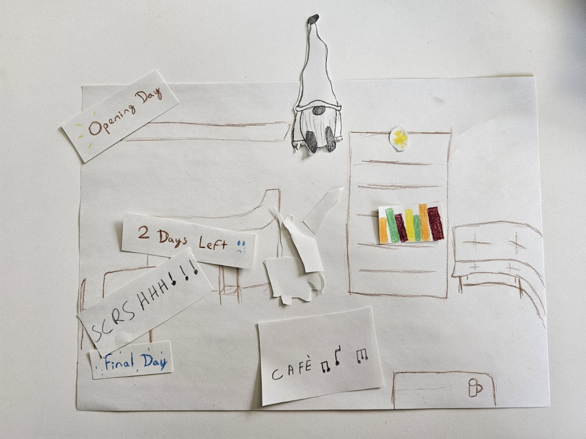

# Baked fragments

## Context
Tea Room

## Intention
Over the years, Monika's café has become a whole world filled with gifts, but the sad time has now arrived for the shop to close. When the very first object ever given to the café shatters, a new customer named Tom starts putting the pieces back together. As the pieces come back together, the café's beautiful history unfolds, but it also brings us progressively closer to the café’s end.

## Cardboard / Paper prototype : 
