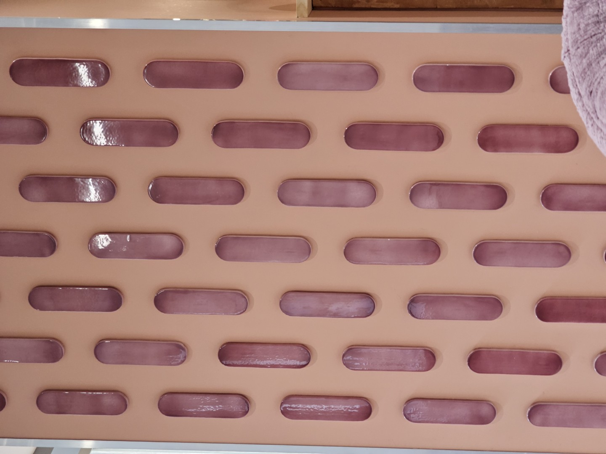
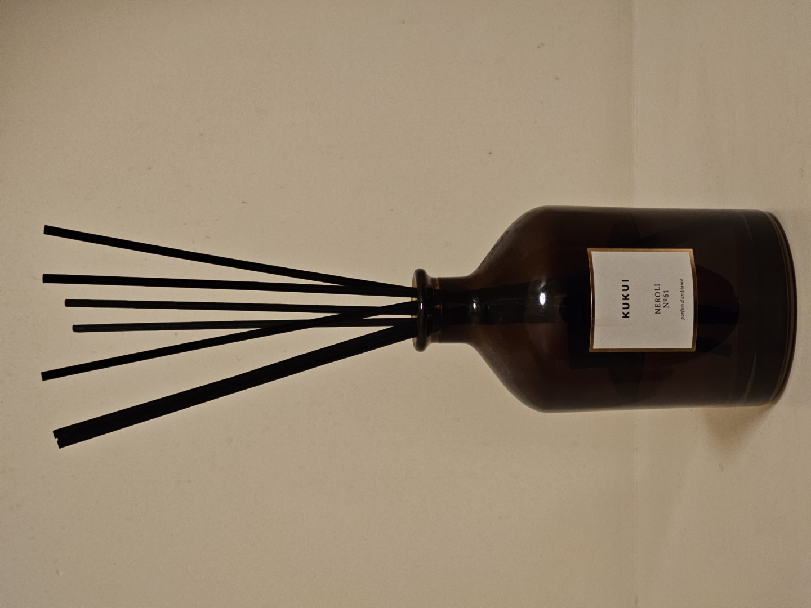
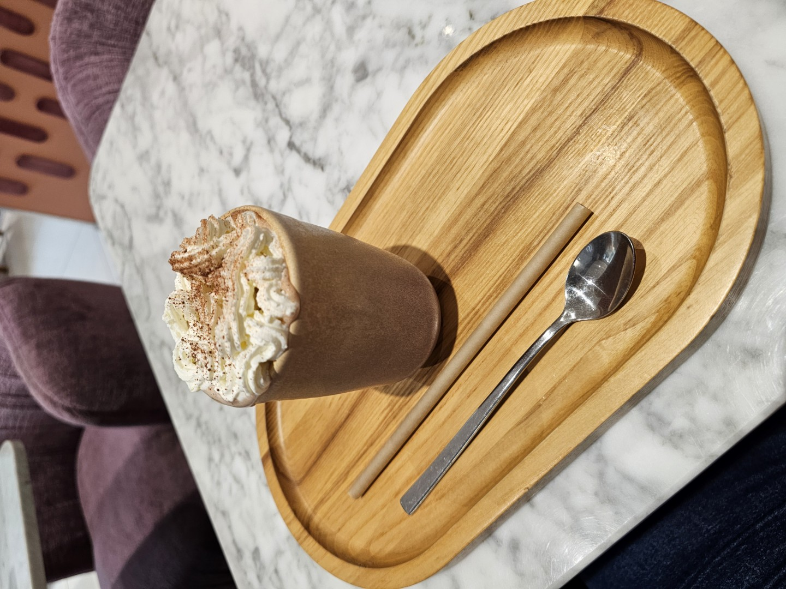

# Observation 00: La Bastide Café (05.05.26)

## Atmosphere & Sounds
- Sound of machines
- Musique playing on a speaker
- The music is chill and almost lofi without really lyrics expect some that has one phrase saying sometime like in the background

## Visual Design
- Walls orange saumon 
  - 
- Some walls are light blue
- Some sofas violet and banc turquoise pale
- Tables are in marble and the feet looks like gold
- Some shelves with decoration on it
    - Plants
    - Lavenders
    - Some bottle of syrups maybe
- It has a nice style making feel a bit like summer or - italian greek style idk

## Layout & Spaces
- The room have the "bar" at the middle and sits from both side with some bar like in front of a big window that show the street
- There is 2 types of sitting
    - The one with sofas
    - The bar like with cushions white and orange
- There is a 2nd floor
- The 2nd floor is the toilette
  - 
- There is a sign at the top of the "bar" that say that we have to please order here
- Menus on the tables

## Service & Functionality
- There one people working here
- She make the orders and wash the things wgen people leaves
- The orders is served on a wooden plate
- There is water with glasses to serve us
- I dont know if i have to bring back my plate because she comes to give me when i orders

## Observations & Events
- At some point i was alone
- There was a bird inside
    - The girl made it go outside
- Bilingue english french

## Experience
- I take a hot chocolate with chantilly and it was a bit expensive but good not too sweet 
  - 